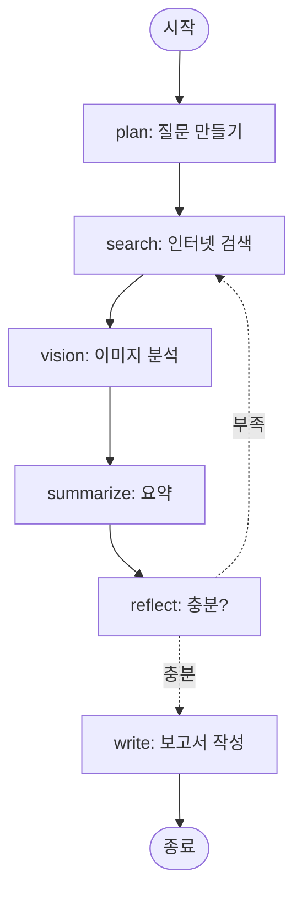
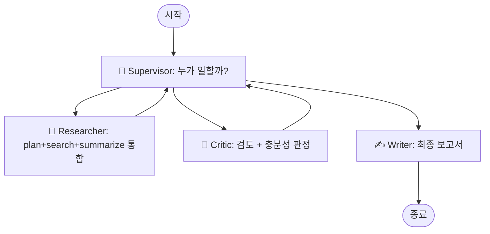

# 📖 LangGraph 리서치 에이전트 — 종합 가이드

> 이 문서는 **개발 지식이 없어도** 이 서비스가 무엇이고, 어떻게 동작하며, 어떤 기능을 어떻게 쓰는지 이해할 수 있도록 작성됐습니다.

---

## 목차

1. [한 줄 소개](#1-한-줄-소개)
2. [이 서비스는 무엇인가요?](#2-이-서비스는-무엇인가요)
3. [어떤 일을 자동으로 해주나요?](#3-어떤-일을-자동으로-해주나요)
4. [빠른 시작 (3분)](#4-빠른-시작-3분)
5. [화면 한 바퀴 둘러보기](#5-화면-한-바퀴-둘러보기)
6. [기능 한눈에 보기](#6-기능-한눈에-보기)
7. [상황별 사용법 (레시피)](#7-상황별-사용법-레시피)
8. [🤖 멀티 에이전트 모드 자세히 보기](#8--멀티-에이전트-모드-자세히-보기)
9. [📂 검색 소스 자세히 보기 (웹 / 사내 / 하이브리드)](#9--검색-소스-자세히-보기-웹--사내--하이브리드)
10. [옵션 자세히 알아보기](#10-옵션-자세히-알아보기)
11. [어떤 기술이 사용됐나요?](#11-어떤-기술이-사용됐나요)
12. [자주 묻는 질문](#12-자주-묻는-질문)
13. [트러블슈팅](#13-트러블슈팅)

---

## 1. 한 줄 소개

> **주제 한 줄을 입력하면, AI 여러 명이 협력해서 인터넷을 검색하고 마크다운 보고서를 작성해주는 자동 리서치 도구입니다.**

비유하자면 — 신입 인턴 5명에게 주제 하나를 던지면, 한 명은 질문을 만들고, 한 명은 검색하고, 한 명은 요약하고, 한 명은 검토하고, 마지막 한 명은 보고서를 써내는 그런 시스템입니다. 모든 단계가 자동으로 일어나고, 사용자는 결과만 받아 보면 됩니다.

---

## 2. 이 서비스는 무엇인가요?

### 🎯 한 마디로

**리서치 자동화 도구**입니다.

### 🤔 좀 더 자세히

주제 (예: `벡터 데이터베이스 2025년 동향`)를 입력하면, AI 시스템이 다음을 자동으로 수행합니다:

1. 그 주제를 **3~5개의 sub-question**으로 쪼갭니다
2. 각 sub-question을 **인터넷 검색** (Tavily 검색 엔진)
3. 검색 결과를 **요약** (각 출처 본문을 AI가 읽고 핵심만 추출)
4. **충분한지 자가 평가** — 부족하면 추가 검색 (최대 3회 반복)
5. 모든 자료를 모아 **마크다운 보고서로 작성** (인용 링크 포함)
6. (선택) 보고서를 **다른 AI가 점수 매김** (정확성·인용·구조·가독성·길이)

### 🆚 ChatGPT 검색이랑 다른 점


| 항목        | ChatGPT (일반 검색) | 이 서비스                          |
| --------- | --------------- | ------------------------------ |
| 결과        | 한 번에 답변         | 단계별 그래프 실행 (시각화)               |
| 출처        | 종종 누락           | 모든 보고서에 인용 [1], [2] + 클릭 가능 링크 |
| 재시도       | 사용자가 직접         | "정보 부족" 자동 판단 → 추가 검색          |
| 보고서 품질 검증 | 없음              | 내장 자가 검수 + LLM 채점              |
| 옵션        | 거의 없음           | 30+ 토글 (언어, 길이, 스타일, 출처 도메인 등) |
| 자료 저장     | 사라짐             | 영구 저장, 나중에 다시 보기 가능            |


---

## 3. 어떤 일을 자동으로 해주나요?

### 🟢 잘하는 것

- **새로운 주제 빠르게 파악** — "MCP 프로토콜이 뭐지?"
- **기술/제품 비교** — "Pinecone vs Chroma 장단점"
- **트렌드 정리** — "2025년 AI agent framework 동향"
- **학습용 자료 수집** — "RAG vs fine-tuning"
- **회의 / 발표 사전조사** — "최근 한국 LLM 기술 사례"
- **🏢 사내 위키 검색** — Confluence 페이지 기반 회사 컨텍스트 보고서
- **💬 사내 Slack 검색** — 본인이 가입한 채널의 최근 30일 메시지 기반
- **🔀 웹+사내 통합** — 외부 트렌드와 회사 사례를 한 보고서에

### 🟡 어느 정도 가능한 것

- **한국어 보고서** — 옵션으로 켜면 한국어로 작성 (한국어 출처도 검색)
- **학술 자료 중심** — 도메인 필터로 arxiv.org만 검색
- **시각 자료 분석** — 차트/다이어그램이 있는 페이지에서 이미지 분석

### 🔴 잘 못하는 것

- **실시간 정보** — 주가, 스포츠 점수 같은 분 단위 변경 정보
- **개인정보 검색** — 약관 위반
- **로그인 필요한 페이지** — 사내 위키 등 (별도 통합 필요)

---

## 4. 빠른 시작 (3분)

### 사전 준비

- macOS / Linux / Windows
- 인터넷 연결
- API 키 2개 (둘 다 무료):
  - **Google Gemini** (LLM): [https://aistudio.google.com/](https://aistudio.google.com/)
  - **Tavily** (검색): [https://tavily.com/](https://tavily.com/)

### 단계 1 — 프로젝트 받기

```bash
git clone https://github.com/arron-k/LangChain-Project.git
cd LangChain-Project
```

### 단계 2 — 키 입력

`.env` 파일을 만들고 키 입력:

```
GOOGLE_API_KEY=AIza...여기에_본인_키
TAVILY_API_KEY=tvly-...여기에_본인_키
```

(추가로 `GROQ_API_KEY=gsk_...` 입력하면 Gemini 한도 소진 시 자동 백업)

### 단계 3 — 실행

```bash
# uv 설치 (한 번만, Mac 기준)
brew install uv

# 의존성 설치 + Streamlit 실행
uv sync
uv run streamlit run ui/app.py
```

브라우저 자동으로 열림 → [http://localhost:8501](http://localhost:8501)

### ✅ 완료

- 토픽 입력 → 🚀 실행
- 30초~2분 후 보고서 등장

### ➕ (선택) 사내 RAG 추가 셋업

회사 Confluence / Slack 검색도 켜고 싶다면 [섹션 9](#9--검색-소스-자세히-보기-웹--사내--하이브리드) 참고:

```bash
# 1. Ollama 설치 + 모델 받기 (한 번만)
brew install ollama
ollama pull qwen2.5vl:7b    # chat
ollama pull all-minilm       # embedding

# 2. .env에 추가
echo "OLLAMA_BASE_URL=http://localhost:11434" >> .env
echo "CONFLUENCE_URL=https://yourcompany.atlassian.net" >> .env
echo "CONFLUENCE_USER=you@example.com" >> .env
echo "CONFLUENCE_API_TOKEN=ATATT..." >> .env
echo "SLACK_TOKEN=xoxp-..." >> .env

# 3. 첫 인제스션
ollama serve &
uv run python scripts/ingest_internal.py --source wiki --source slack
```

---

## 5. 화면 한 바퀴 둘러보기

```
┌─────────────────────────────────────────────────────────────────┐
│  🔬 LangGraph Research Agent                                     │
├──────────────────────┬──────────────────────────────────────────┤
│  [사이드바]           │  [메인 영역]                              │
│                      │                                          │
│  Settings            │  ┌──────────┬──────────┬───────────┐    │
│   UI 언어           │  │ ▶️ 새 실행 │ ↪️ 이어서 │ 🆚 A/B 비교│    │
│   LLM provider 상태  │  └──────────┴──────────┴───────────┘    │
│   Secrets (마스킹)   │                                          │
│                      │  Topic: [______________________]         │
│  📝 보고서 옵션       │                                          │
│   언어 / 스타일 / 길이 │  [🚀 실행]  [➡️ 재개]                   │
│                      │                                          │
│  🔧 그래프 옵션       │  (실행 후)                                │
│   sub-question 수    │  🟢 plan       (변화분 JSON)              │
│   max iterations     │  🟢 search     (URL 9개)                  │
│   12개 토글          │  🟢 summarize  (요약 3개)                 │
│                      │  🟢 reflect    (충분?)                    │
│  🔍 검색 필터         │  🟢 write      (최종 보고서)              │
│   include/exclude    │                                          │
│   기간               │  📄 Final Report                          │
│                      │  [⬇️ MD] [⬇️ PDF] [⬇️ DOCX]                │
│  Thread              │  # 보고서 본문...                          │
│   검색 / 드롭다운     │                                          │
│   Rename / Tags / ⭐  │  📊 Summary  🔗 Sources                   │
│                      │  🎯 Quality Score                          │
│  🛠 Ops              │  🖼 Image findings                          │
│   Usage / Cache /    │  🧠 Reflexion memo                         │
│   Threads / Judge /  │  🔗 Claim verification                     │
│   Feedback           │  💬 Feedback (👍 / 👎)                     │
│                      │                                          │
│  📐 Graph 다이어그램   │                                          │
└──────────────────────┴──────────────────────────────────────────┘
```

### 사이드바

**모든 옵션과 상태**가 들어있는 컨트롤 패널.

### 메인 영역의 3개 탭

1. **▶️ 새 실행 / 이어서** — 일반적인 사용
2. **↪️ 기존 thread 복원** — 이전 결과 다시 보기 + 추가 질문
3. **🆚 A/B 비교** — 두 옵션 조합을 자동 비교

---

## 6. 기능 한눈에 보기

### 🎨 표시/언어


| 기능         | 설명                            |
| ---------- | ----------------------------- |
| UI 언어      | 한국어 ↔ 영어 즉시 전환                |
| 보고서 언어     | UI와 독립 (UI 영어 + 보고서 한국어 가능)   |
| 다크 / 라이트   | 보라색 테마 (Streamlit 메뉴에서 변경 가능) |
| Compact 모드 | 모바일 / 좁은 화면 대응                |


### 📝 보고서 스타일


| 옵션              | 효과                                                 |
| --------------- | -------------------------------------------------- |
| Style           | concise / detailed / academic / blog               |
| Length          | short(<300자) / medium(600~~800) / long(1200~~1800) |
| Sub-questions 수 | 1~6 (검색 횟수 결정)                                     |
| Max iterations  | 1~5 (재검색 한도)                                       |


### 📂 검색 소스 (신규)


| 옵션              | 효과                                                              |
| --------------- | --------------------------------------------------------------- |
| 🌐 웹 검색만        | Tavily 검색 엔진 (기본)                                              |
| 🏢 사내 문서만       | Confluence Wiki + Slack — Ollama 임베딩 + Chroma 벡터 DB             |
| 🔀 웹 + 사내       | 둘 다 병렬 호출 후 정규화/가중치/dedup으로 통합                                  |
| 활성 사내 소스        | wiki / slack 멀티셀렉트                                              |
| 인제스션 — 변경분만     | 마지막 동기화 이후 변경된 문서만 색인 (~10초)                                    |
| 인제스션 — 전체 재색인   | 모든 청크 삭제 + 처음부터 색인 (wiki 6분 / slack 2분)                          |
| 마지막 동기화 일시      | 소스별 표시 (예: "5m ago")                                            |
| 하이브리드 가중치       | 웹 vs 사내 비중 슬라이더 (0~1)                                           |
| 출처 배지           | 🌐 (웹) / 📚 (Wiki) / 💬 (Slack) 시각적 구분                            |


### 🔍 검색 품질


| 옵션        | 효과                              |
| --------- | ------------------------------- |
| 도메인 포함/제외 | github.com만 검색, reddit.com 제외 등 |
| 기간 필터     | 1일/1주/1개월/1년 이내 자료만             |
| LLM 재정렬   | 검색 결과 관련도를 AI가 다시 점수 매김         |
| 최소 점수     | 임계값 이하 결과 자동 폐기                 |
| 도메인 다양화   | 한 사이트 독점 방지                     |
| 신선도 가드    | 오래된 자료 자동 제거                    |


### 🤖 AI 능력 강화

각 옵션이 구체적으로 어떤 문제를 풀고, 켜기 전후가 어떻게 달라지는지 자세히 설명합니다.

---

#### 🔍 자가 검수 (Critic) — 보고서 쓰기 전 한 번 더 본다

**문제**: 요약만 보고 바로 보고서 작성하면 빈틈이 있어도 모름.

**동작**: 요약 끝난 직후 비평가 AI가 끼어들어 "이 요약 어디가 약한지" 메모. 그 메모를 reflect 단계가 보고 "더 검색해야 하나" 판단의 근거로 사용.

**Before**:
> summary: "Pinecone은 빠른 벡터 DB이다."
> reflect: "충분해 보임 → 보고서 작성"

**After**:
> summary: "Pinecone은 빠른 벡터 DB이다."
> 🧐 critic: "성능 수치가 모호함. '빠르다'의 기준 없음. 경쟁 제품 대비 데이터 누락"
> reflect: "비평이 구체적이니 추가 검색 필요 → search 다시"

**비용**: LLM 호출 +1회 / 라운드
**추천 상황**: 학술 / 기술 비교 / 수치가 중요한 토픽

---

#### 📚 검색 결과 깊게 읽기 (Tavily Extract) — 짧은 요약 대신 페이지 전체

**문제**: Tavily 기본 응답은 페이지당 ~500자 요약만 줌. 핵심 데이터가 누락될 수 있음.

**동작**: 각 sub-question의 1순위 hit 페이지를 Tavily Extract로 한 번 더 호출 → 본문 ~3000자까지 확장 → 요약/보고서가 더 풍부한 정보 활용.

**Before**:
> hit content: "Vector DB benchmarks show varying performance..."
> (200자 요약 — 구체 수치 없음)

**After**:
> hit content: "Pinecone p50 latency: 12ms, p99: 45ms.
> Chroma p50: 28ms, p99: 110ms. Test setup: 1M vectors, 768d..."
> (3000자 본문 — 구체 수치/조건 포함)

**비용**: Tavily 호출 +N회 (sub-question 수만큼)
**추천 상황**: 벤치마크 / 기술 사양 / 가격 비교

---

#### ✅ 자가 교정 Writer (Self-correct) — 초안 → 검토 → 재작성

**문제**: LLM이 첫 번째 초안에서 가끔 인용 누락 / H1 빠뜨림 / 구조 약함.

**동작**: write_node가 초안 작성 → 에디터 LLM이 읽고 구체적 문제 5개까지 식별 → 문제 있으면 같은 작성자에게 피드백 주고 1회 재작성.

**Before**:
> "# Vector Databases
> Pinecone is fast. Chroma is open source.
> ## Sources: ..."
> (인용 누락, 짧음, 비교 부족)

**After (검토 후 재작성)**:
> "# Vector Databases for RAG
> ## Performance
> Pinecone offers p99 latency of 45ms [1], outperforming
> Chroma's 110ms [2] in 1M-vector benchmarks.
> ## Open Source vs Managed
> ..."
> (인용 [N] 추가, 구조 명확, 데이터 포함)

**비용**: LLM 호출 +1~2회 (검토 1 + 필요 시 재작성 1)
**추천 상황**: 외부 공유용 보고서 / 발표 자료 / 블로그 포스트

---

#### 🔗 출처 교차 검증 (Cross-reference) — 단일 출처 주장 식별

**문제**: 보고서의 어떤 주장이 신뢰할 만한지 (여러 출처 vs 단 1개) 한눈에 안 보임.

**동작**: 보고서 작성 후 LLM이 핵심 주장 6개 추출 → 각 주장에 어떤 출처 [N] 이 뒷받침하는지 매핑 → 위험도 (ok / single-source / unsupported / conflicting) + 신뢰도 (0~10) 부여.

**Before**: 보고서만 보고 어디가 위험한지 모름.

**After (검증 패널)**:
| 주장 | 출처 | 위험도 | 신뢰도 |
|---|---|---|---|
| Pinecone p50 latency 12ms | [1], [3], [5] | 🟢 ok | 8.5 |
| 한국 시장 점유율 30% | [2] | 🟡 single-source | 4.0 |
| 2025년 출시 예정 X | (없음) | 🔴 unsupported | 1.0 |

**비용**: LLM 호출 +1회
**추천 상황**: 신뢰도가 중요한 모든 보고서 (특히 학술/법률)

---

#### 🧠 이전 실행 학습 (Lessons memory, B8) — 텍스트 메모 누적

**문제**: 비슷한 주제를 매번 처음부터 다시 — 이전에 깨달은 점이 사라짐.

**동작**: 매 실행 끝에 `lessons.json`에 reflection 텍스트 저장. 다음에 비슷한 토픽 만나면 plan 단계에서 이전 메모 200자를 컨텍스트로 주입.

**Before**:
> 1차 실행 (LangGraph reflection): 깊이 부족, sufficient=False
> 2차 실행 (LangGraph supervisor): 또 같은 깊이 부족 패턴

**After**:
> 1차: lessons.json에 "depth lacking" 저장
> 2차 plan 시: "Past reflection: depth lacking"이 시스템 프롬프트에 포함
> → 더 구체적인 sub-question 생성

**비용**: 추가 호출 0 (저장은 부산물, 활용은 plan 프롬프트 길이만 증가)
**추천 상황**: 같은 분야를 반복적으로 리서치할 때 (예: 매주 AI 동향)

---

#### 🧠 진짜 자기학습 (Reflexion, R12) — 구조화된 자기 반성

**문제**: B8의 텍스트 메모는 "그냥 reflection 복사" 수준. 더 행동 가능한 학습이 필요.

**동작**: write_node 끝에 별도 LLM 호출로 **구조화된 메모** 생성:
- ✅ what_worked: 잘된 점 2~3개
- 🔧 what_to_improve: 개선할 점 2~3개
- 🎯 strategy_for_next_time: 다음번 한 줄 전략

다음 plan 단계는 텍스트가 아닌 **명확한 라벨 (Strategy: / Avoid:)** 로 주입 → LLM이 더 잘 따름.

**Before (B8만)**:
> Past reflection: "출처가 약함, 깊이가 부족했음, 시장 데이터 없음"
> → LLM이 이 텍스트를 어떻게 해석할지 불명확

**After (R12)**:
> Strategy: "벤치마크 수치를 명시적으로 sub-question에 포함하라"
> Avoid: "단일 reddit 출처에 의존하지 말 것"
> → LLM이 행동 지침으로 명확히 따름

**비용**: LLM 호출 +1회 (구조화 생성)
**추천 상황**: 회귀적 학습이 가치 있는 도메인 (반복 리서치) — UI에 3 컬럼 패널로 시각화됨

---

#### 🖼 이미지 / 차트 분석 (Vision, R11) — 시각 자료 해석

**문제**: 벤치마크 차트, 아키텍처 다이어그램이 페이지에 있어도 텍스트로만 보면 정보 손실.

**동작**: search_node가 Tavily에 `include_images=True` 요청 → 이미지 URL 수집 → Vision AI (Gemini Vision)에게 "이 이미지를 질문 컨텍스트와 함께 설명해" → 결과를 evidence에 추가.

**Before**:
> 보고서: "Pinecone과 Chroma의 성능 차이가 있다."
> (이미지 무시)

**After**:
> 보고서: "벤치마크 차트(출처 [1])를 보면 Pinecone이 1M~10M 벡터 구간에서
> Chroma 대비 일관되게 낮은 latency를 보인다.
> 특히 10M 구간에서 격차가 3배 이상으로 벌어진다."
> (이미지 + 차트 해석 반영)

UI: 결과 화면 하단 **🖼 Visual findings** 섹션에 썸네일 + 설명 표시.

**비용**: Vision LLM 호출 +최대 5회 (멀티모달 입력은 일반 텍스트보다 토큰 사용량 ↑)
**추천 상황**: 벤치마크 / 아키텍처 / 제품 비교 — 시각 자료가 핵심 정보인 토픽

---

#### 🤖 멀티 에이전트 모드 — 전문가 팀

**문제**: 한 LLM이 모든 단계를 같은 톤으로 처리 → 검토자도 작가도 같은 관점.

**동작**: 그래프 구조 자체가 변경 — Supervisor + Researcher + Critic + Writer 4명이 협업. 각자 다른 페르소나/모델.

**Before (일반)**:
```
plan → search → vision → summarize → reflect → write
(모두 같은 모델, 같은 시스템 프롬프트 톤)
```

**After (Multi-agent)**:
```
Supervisor가 매 라운드 결정
  → Researcher (조사 전문가 페르소나)
  → Critic (엄격한 비평가 페르소나)
  → Writer (편집자 페르소나)
```

**비용**: Supervisor 호출 4~6회 / 그래프 (deterministic은 무료, LLM 모드는 +N회)
**추천 상황**: 다양한 관점이 필요한 주제 / 확장 토대

(자세한 비교는 **섹션 8** 참조)

---

#### 🎭 에이전트별 모델 자동 배정 (R2) — 멀티 에이전트의 진가

**문제**: 멀티 에이전트인데도 모든 에이전트가 같은 모델 → 차별화 효과 미미.

**동작**: 키 보유한 프로바이더 중에서 역할에 맞는 모델 자동 선택:
- 🔬 Researcher: Google Gemini Flash Lite (저렴, 빠름)
- 🧐 Critic: Groq Llama 3.3 70B (엄격한 추론에 강함)
- ✍️ Writer: Google Gemini 2.5 Flash (자연스러운 글쓰기)

**Before (R2 OFF)**: 모든 에이전트가 Gemini Flash Lite → 비평도 모호함.

**After (R2 ON)**:
- Critic이 Llama 70B로 더 엄격하게 비평 → 빈틈 더 잘 찾음
- Writer가 Gemini 2.5로 더 매끄럽게 작성 → 가독성 ↑

**비용**: 추가 호출 0 (같은 호출 수, 모델만 다름). 단 Groq 호출은 별도 quota.
**추천 상황**: Multi-agent 모드 + 다중 프로바이더 키 보유 시

---

#### 🧠 LLM 기반 Supervisor (R6) — 더 유연한 라우팅

**문제**: 기본 Supervisor는 if/else 규칙 → "지금 비평이 형식적이니 한 번 더" 같은 미세 판단 불가.

**동작**: supervisor 호출 시 deterministic 규칙 대신 **LLM이 state 스냅샷 보고 결정**. 출력은 `SupervisorDecision` 스키마 (next + reason).

**Before (deterministic)**:
> "summaries 있고 critique 있고 sufficient=true → writer"
> (단순 분기)

**After (LLM)**:
> 입력: "Topic: X, Iter 2/3, Critique: 'shallow analysis', sufficient: true"
> LLM 결정: {"next": "researcher", "reason": "critique flags shallow analysis even though sufficient=true"}
> → 더 깊게 파고듦

**비용**: supervisor 방문 1번당 LLM +1회 (그래프당 보통 4~6회 추가)
**추천 상황**: 복잡한 판단이 필요한 토픽 / Groq 등 빠른 모델 보유 시


### 📤 결과물 활용


| 기능        | 설명                               |
| --------- | -------------------------------- |
| 마크다운 다운로드 | .md 파일                           |
| PDF 다운로드  | 인쇄·공유용                           |
| DOCX 다운로드 | Word 문서                          |
| 클릭 가능한 인용 | [1], [2] 클릭 → 출처 페이지로            |
| 신선도 배지    | 🟢 신선 / 🟡 1년내 / 🟠 3년내 / ⚠️ 오래됨 |
| 자동 평가     | LLM이 5기준 0~10점 채점                |


### 🗂 자료 관리


| 기능         | 설명                  |
| ---------- | ------------------- |
| Thread 영속성 | 모든 실행 결과 영구 저장      |
| Thread 검색  | 토픽/태그/ID로 찾기        |
| 즐겨찾기 ⭐     | 중요한 thread 상단 고정    |
| 이름 변경 / 태그 | 편하게 정리              |
| 일괄 삭제      | 정리 기능               |
| 검색 캐시      | 24시간 내 같은 검색 즉시 재사용 |


### 🔍 실행 / 운영


| 기능               | 설명                   |
| ---------------- | -------------------- |
| 노드별 실시간 진행       | "지금 어디까지 됐는지" 시각화    |
| 토큰 단위 스트리밍       | 보고서가 한 글자씩 타자기처럼 출력  |
| Interrupt (HITL) | write 직전 정지 → 사용자 검토 |
| 사용량 대시보드         | LLM 호출 수, 평균 지연 시간   |
| 평균 점수            | 최근 7일 평균 품질 점수       |
| 사용자 피드백          | 👍 / 👎 + 코멘트 누적     |


### 🆚 A/B 자동 비교

5개 프리셋 중 두 개 골라서 동시에 실행 → AI 채점관이 승자 선언:

- 🚀 기본 — 빠르고 단순
- 🔍 검색 품질 강화
- ✅ 보고서 신뢰도 강화
- 🤖 전문가 팀 모드
- 🏆 최고 품질

---

## 7. 상황별 사용법 (레시피)

### 🍱 레시피 1 — "5분 안에 새 기술 빠르게 파악"

**상황**: 회의 5분 전, 모르는 기술 용어가 나옴.

```
사이드바:
  보고서 언어: 🇰🇷 한국어
  Style: concise
  Length: short
  추가 옵션: 모두 OFF

토픽: "MCP 프로토콜"
🚀 실행 (약 30초)
```

→ 300자 미만 한국어 요약 + 9개 출처.

---

### 🎓 레시피 2 — "공부용 깊이 있는 자료"

**상황**: 새 분야를 본격적으로 공부.

```
보고서 언어: 한국어
Style: detailed (또는 academic)
Length: long
✅ 검색 결과 깊게 읽기 ON
✅ 출처 교차 검증 ON
도메인 포함: arxiv.org, openreview.net (학술 자료만)
기간: 1년 이내

토픽: "Transformer attention 종류 비교"
🚀 실행 (약 2~3분)
```

→ 1500~1800자 학술 톤 보고서 + 검증된 출처 + 클릭 가능 인용.

---

### 📰 레시피 3 — "주간 트렌드 모니터링"

**상황**: 매주 월요일 업계 동향 정리.

```
Style: concise
Length: medium
기간: 1주 이내 (또는 1개월)
✅ 출처 다양화 ON
✅ 신선도 가드 ON (90일)

토픽 1: "AI agent framework 최근 업데이트"
토픽 2: "벡터 DB 신규 출시 2025"
...
```

각 thread를 즐겨찾기 ⭐ 처리 → 매주 같은 토픽 다시 실행.

---

### 🔬 레시피 4 — "최고 품질 보고서 (외부 공유용)"

**상황**: 발표 자료, 블로그 글, 외부 공유.

```
🆚 A/B 비교 탭
  Preset A: 🚀 기본
  Preset B: 🏆 최고 품질
  Topic: "내 주제"
🚀 A/B 실행 (약 3~5분)
```

→ B가 보통 이김 → B 보고서 ⬇️ PDF 다운로드 → 공유.

---

### 🤔 레시피 5 — "어떤 옵션이 좋은지 모르겠음"

**A/B 비교** 탭 적극 활용:

1. 평소 쓰던 옵션 vs 새 옵션 비교 → 점수 차이 확인
2. 사이드바 🎯 최근 7일 평균 보면 어떤 옵션 조합이 평균 점수 높은지
3. 👍 많이 받은 thread 살펴보고 그 옵션 따라 쓰기

---

### 💡 레시피 6 — "이미지 / 차트 중심 주제"

**상황**: 데이터 비교, 제품 사진 분석.

```
✅ 이미지 / 차트 분석 ON
Topic: "Vector DB 성능 벤치마크 비교"
🚀 실행
```

→ 결과 화면에 차트 이미지 + AI 해석 등장. 보고서에 시각 자료 정보 반영.

---

### 🔄 레시피 7 — "이전 결과 다시 보기 + 추가 질문"

```
↪️ 기존 thread 복원 탭
사이드바에서 thread 검색 또는 드롭다운에서 선택
이전 보고서 등장
하단 "🔁 이어서 리서치" 입력란에 추가 질문
➕ 추가 리서치
```

→ 기존 결과 위에 새 sub-question 추가 검색 → 보강된 보고서.

---

## 8. 🤖 멀티 에이전트 모드 자세히 보기

이 서비스의 가장 흥미로운 기능 중 하나입니다. 토글 한 번으로 **그래프 자체의 구조가 바뀝니다.** 이 섹션은 그게 무엇이고 어떻게 다른지 처음부터 끝까지 풀어 설명합니다.

### 8-1. 비유로 먼저

```
일반 모드        :  혼자 일하는 프리랜서
                    (모든 단계를 한 사람이 순서대로)

멀티 에이전트 모드 :  3명의 전문가 + 팀장
                    (Researcher / Critic / Writer + Supervisor)
```

**일반 모드**는 "내가 자료조사도 하고 검토도 하고 글도 써야 한다" — 각 단계가 한 명의 작업.

**멀티 에이전트 모드**는 "조사는 조사 전문가, 검토는 비평 전문가, 글은 에디터가 쓴다 — 팀장이 누가 일할지 결정한다" — 역할별 분업.

### 8-2. 두 모드의 그래프 시각화

#### 일반 모드 (토글 OFF)



→ **고정된 순서**: plan → search → vision → summarize → reflect → write
→ reflect가 "부족"이라 판단할 때만 search로 회귀

#### 멀티 에이전트 모드 (토글 ON)



→ **유연한 순서**: Supervisor가 매번 state를 보고 다음 에이전트 선택
→ 각 에이전트가 **여러 단계를 통째로** 처리

### 8-3. 각 에이전트가 무엇을 하는가

#### 🔬 Researcher (조사 전문가)

**역할**: 자료 수집 한 라운드 통째로

```
내부 동작 (한 번 호출되면):
  ① 필요시 plan_node 실행 → sub-questions 생성/재구성
  ② search_node → Tavily 검색 (선택적으로 vision 포함)
  ③ summarize_node → 검색 결과를 요약

결과: state에 summaries, search_results, iteration 누적
```

**페르소나** (R1 옵션):
> "You are a thorough Research Specialist. Cite many primary sources, include specific numbers/dates/names, prefer authoritative references."

#### 🧐 Critic (비평가)

**역할**: 검토 + 충분성 판정

```
내부 동작:
  ① critic_node → 요약의 빈틈/모호함/모순 메모 작성
  ② reflect_node → "이 정도면 보고서 쓸 만한가?" 판정
                    → sufficient=True/False + 부족하면 gap 질문

결과: critique 텍스트 + sufficient 플래그 + 필요 시 새 sub_questions
```

**페르소나**:
> "You are a Strict Research Critic. Find vague claims, missing nuance, logical gaps, unsupported assertions. Be rigorous and unforgiving."

#### ✍️ Writer (작가)

**역할**: 최종 마크다운 보고서 작성

```
내부 동작:
  ① 모든 summaries + 출처 + 이미지 분석 + 페르소나 종합
  ② Style/Length 옵션 따라 마크다운 보고서 작성
  ③ 자가 교정 ON이면 1회 검토+재작성

결과: state.final_report
```

**페르소나**:
> "You are an Editorial Writer. Prioritize clarity, narrative flow, well-structured sections, coherent story."

#### 🎯 Supervisor (팀장)

**역할**: state를 보고 다음에 누가 일할지 결정

**기본 (deterministic) 로직**:

```python
def supervisor_router(state):
    if state.has_final_report:
        return "END"           # 보고서 있으면 끝
    if not state.summaries:
        return "researcher"    # 요약 없으면 조사
    if not state.critique:
        return "critic"        # 비평 없으면 검토
    if state.sufficient:
        return "writer"        # 충분하면 작성
    if state.iteration >= max_iterations:
        return "writer"        # 한도 초과면 강제 작성
    return "researcher"        # 부족하면 다시 조사
```

**LLM 기반 옵션** (R6 토글 ON):
- 위 규칙 대신 **LLM이 state 보고 직접 결정**
- 더 유연한 판단 (예: "지금 비평이 약하니 한 번 더")
- 비용: supervisor 호출마다 LLM 1회 추가

### 8-4. 실제 실행 흐름 (예시)

토픽 `"Vector databases for RAG"` + 멀티 에이전트 모드 ON:

```
[1] START → Supervisor
    state = {summaries: [], critique: "", final_report: ""}
    "summaries 없음 → Researcher"

[2] Supervisor → 🔬 Researcher
    내부에서 plan + search + summarize 통째로 실행
    - plan: 3개 sub-questions 생성
    - search: Tavily 3번 호출 → 9개 hits
    - summarize: AI 3번 호출 → 3개 요약
    state += {summaries: [3개], iteration: 1}

[3] Researcher → Supervisor
    "critique 없음 → Critic"

[4] Supervisor → 🧐 Critic
    내부에서 critic + reflect 통째로 실행
    - critic: "출처 [2]가 약함, [3]은 일반론" 메모
    - reflect: sufficient=true 판정
    state += {critique: "...", sufficient: true}

[5] Critic → Supervisor
    "sufficient=true → Writer"

[6] Supervisor → ✍️ Writer
    페르소나 + 모든 summaries + 출처로 보고서 작성
    state.final_report = "# Vector Databases for RAG\n..."

[7] Writer → END
    완료!
```

#### 📍 만약 Critic이 "부족"이라 판정하면?

```
[4'] Critic → Supervisor
     state += {sufficient: false, sub_questions: [새 질문 2개]}

[5'] Supervisor: "sufficient=false, iter=1<3 → Researcher"

[6'] 🔬 Researcher 다시 (plan_node가 새 질문으로 재계획)
     state += {summaries: [총 5개], iteration: 2}

[7'] Researcher → Supervisor → Critic 다시
     ...iteration이 max에 도달할 때까지 반복
```

### 8-5. 일반 모드 vs 멀티 에이전트 비교표

| 측면 | 일반 모드 | 멀티 에이전트 모드 |
|---|---|---|
| **노드의 정의** | "한 가지 작업 단계" | "역할을 가진 에이전트" |
| **노드 수** | 6개 (plan/search/vision/summarize/reflect/write) | 4개 (Supervisor + Researcher + Critic + Writer) |
| **순서** | 정해져 있음 | Supervisor가 매번 결정 |
| **분기/루프 방식** | reflect의 conditional edge로 search 회귀 | Supervisor가 어디든 라우팅 가능 |
| **각 노드 책임** | 작업 1개 | 여러 단계 묶음 |
| **페르소나 (R1)** | 적용 안 됨 (모두 같은 톤) | Researcher/Critic/Writer 각자 다른 톤 |
| **에이전트별 모델 (R2)** | 적용 안 됨 | 역할별로 다른 LLM 자동 배정 |
| **그래프 다이어그램** | 직선 + 한 번 분기 | 별 모양 (Supervisor 중심) |
| **호출 횟수** | 비슷함 | 비슷하지만 Supervisor 호출 추가 |
| **확장성** | 노드 끼워넣기 쉬움 | 새 에이전트 추가 자연스러움 |

### 8-6. 어떤 옵션이 멀티 에이전트와 같이 잘 동작하나?

멀티 에이전트 모드의 진짜 가치는 다음 옵션들과 결합할 때 살아납니다:

#### 🎭 R2: 에이전트별 모델 자동 배정

```
Researcher → Google Gemini Flash Lite (저렴, 빠름)
Critic    → Groq Llama 70B (엄격한 추론)
Writer    → Google Gemini 2.5 Flash (자연스러운 글쓰기, 한국어)
```

→ 각 역할이 **그 일을 가장 잘하는 모델**로 처리.

#### 🧠 R6: LLM 기반 Supervisor

```
Deterministic: state 보고 규칙대로 분기
LLM Supervisor: state를 자연어로 이해하고 판단
```

→ "비평이 너무 형식적이니 다시 한 번", "Researcher가 충분히 했으니 Writer로" 같은 유연한 판단.

#### ✅ R7: 자가 교정 Writer

Writer 페르소나 + 자가 교정 → 작가가 자기 글을 다시 읽고 고치는 자연스러운 플로우.

### 8-7. 언제 쓰고 언제 쓰지 말까

#### ✅ 멀티 에이전트가 빛나는 경우

- **다양한 관점**이 중요한 토픽 (예: "AI 윤리 논쟁")
- **각 단계 품질이 다 중요**할 때 (조사 + 검증 + 글쓰기 모두)
- **에이전트별 다른 모델**을 쓰고 싶을 때 (R2 활용)
- **확장 토대**로 사용 (새 에이전트 추가 가능: FactChecker, Translator 등)

#### ❌ 멀티 에이전트가 오버킬인 경우

- **단순 정의 검색** ("MCP 프로토콜이 뭐야?")
- **빠른 확인용** (보고서 품질보다 속도가 우선)
- **무료 한도가 적을 때** (Supervisor 호출이 추가됨)
- **Auto-judge 결과로 점수 차이가 거의 없을 때** (실측해서 결정)

### 8-8. 한계와 솔직한 평가

현재 우리 구현에서:

- **품질 차이는 미미할 수 있음** — Auto-evaluate (Q3)로 실측해보면 일반 모드와 점수 차이가 ±1점 수준
- **진가는 R2 (에이전트별 모델) + R7 (자가 교정) + R6 (LLM Supervisor) 같이 켜야 살아남**
- **확장 토대로서의 가치**가 큼 — 4번째 에이전트 (FactChecker) 추가는 노드 함수 한 개 + supervisor_router 한 줄 변경

### 8-9. 사이드바에서 보이는 것

멀티 에이전트 ON 시:

- 사이드바 **📐 Graph** expander 다이어그램이 자동으로 별 모양 토폴로지로 변경
- **🎭 에이전트별 모델** 토글 활성화 (Multi-agent 전용)
- **🧠 LLM Supervisor** 토글 활성화 (Multi-agent 전용)
- 노드 타임라인에 supervisor 카드가 매번 등장 → 라우팅 흐름 시각화

### 8-10. 한 줄 요약

> **멀티 에이전트 모드는 "단계 중심" 그래프를 "역할 중심" 그래프로 바꾼 것입니다. 같은 노드 함수들을 다르게 조립해서 Supervisor가 매번 다음 작업자를 결정하게 만들고, 각 에이전트에 전문화된 페르소나/모델을 부여할 수 있는 토대를 제공합니다.**

---

## 9. 📂 검색 소스 자세히 보기 (웹 / 사내 / 하이브리드)

이 시스템의 또 다른 핵심 기능입니다. **어디서 정보를 가져올지** 라디오 버튼 하나로 결정합니다. 자세히 풀어드릴게요.

### 9-1. 비유로 먼저

```
🌐 웹 검색만        :  도서관 가서 "최근 출간된 책 중에서" 찾기 (외부, 최신)
🏢 사내 문서만      :  본인 책상 서랍에서 "회사 자료" 찾기 (내부, 안전)
🔀 웹 + 사내 (하이브리드) : 둘 다 동시에 → 합쳐서 정리 (균형)
```

| 모드 | 찾는 곳 | 강점 | 약점 |
|---|---|---|---|
| **🌐 웹** | Tavily 검색 엔진 (Google/Bing 같은 것) | 최신 트렌드, 외부 사례 | 회사 내부 사정 모름 |
| **🏢 사내** | Confluence Wiki + Slack 메시지 | 회사 맥락, 보안 (외부 유출 X) | 인터넷 최신 정보 없음 |
| **🔀 하이브리드** | 둘 다 동시에 | 회사 맥락 + 최신 트렌드 결합 | 가장 느림 (둘 다 호출) |

---

### 9-2. 사내 RAG가 어떻게 동작하나? (단계별)

> RAG = Retrieval-Augmented Generation. "검색해서 가져온 자료로 답변을 만들어주는 방식". ChatGPT가 자기가 외운 지식만 쓰는 게 아니라, **방금 검색한 자료를 보고 답하는 것** 이라고 생각하면 됩니다.

#### 1단계 — 인제스션 (Ingestion) = 자료 미리 모아두기

```
회사 Confluence 페이지 2,009개
                ↓
        [코드가 페이지 본문 가져옴]
                ↓
   본문을 작은 조각(청크)으로 자르기 (400자씩)
                ↓
   각 조각을 "벡터" (384개 숫자 묶음)로 변환 ← Ollama가 함
                ↓
   Chroma 데이터베이스에 저장 (로컬 파일)
                ↓
        23,365개 청크 색인 완료
```

⏱ **6분 소요** (한 번만)

#### 2단계 — 검색 (Retrieval) = 필요할 때 찾기

```
사용자가 "AIDT 학습맵 설계" 토픽 입력
                ↓
        토픽을 동일한 방식으로 벡터로 변환
                ↓
   Chroma가 가장 비슷한 벡터 5개 찾음 (cosine similarity)
                ↓
        그 5개의 원본 본문을 LLM에게 전달
                ↓
        LLM이 그 본문 보고 보고서 작성
```

⏱ **수 초** (매번)

#### 3단계 — 보고서 작성 (Generation)
검색된 본문을 LLM (Gemini / Groq / Ollama)이 읽고 마크다운 보고서 작성. 출처에 Confluence 페이지 URL 그대로 인용.

---

### 9-3. 인제스션 vs 검색 — 헷갈리기 쉬운 점

| | 인제스션 | 검색 |
|---|---|---|
| 언제? | 처음 1번 + 가끔 업데이트 | 매번 토픽 실행할 때 |
| 무엇? | 회사 자료 → 벡터 변환 → 저장 | 토픽과 비슷한 자료 찾기 |
| 비용? | LLM 호출 X, Confluence API 호출만 (느림) | Chroma 로컬 검색 (빠름) |
| 사용자 액션? | 사이드바 "🔄 변경분만" 또는 "♻️ 전체 재색인" 클릭 | 토픽 입력 → 🚀 실행 |

---

### 9-4. 지원하는 사내 소스 — Wiki(Confluence)와 Slack

#### 📚 Wiki (Confluence)

**무엇을 가져오나**:
- 본인이 접근 권한 있는 모든 Confluence 스페이스의 페이지
- 페이지 본문 (HTML → 순수 텍스트로 변환)
- 메타데이터: 페이지 제목, 스페이스 키, 마지막 수정 시각, URL

**필요한 것**:
- Atlassian API 토큰 ([발급 링크](https://id.atlassian.com/manage-profile/security/api-tokens))
- `.env` 에 `CONFLUENCE_URL`, `CONFLUENCE_USER`, `CONFLUENCE_API_TOKEN`
- (선택) `CONFLUENCE_SPACE_KEYS=ENG,PRD` 로 일부 스페이스만 필터링

**예시 결과**:
> 보고서 출처에 `https://yourcompany.atlassian.net/wiki/spaces/ENG/pages/12345678` 등장 → 클릭하면 원본 Confluence 페이지로 이동

#### 💬 Slack

**무엇을 가져오나**:
- 본인이 가입한 채널 (whitelist로 지정)
- 메시지 + 스레드 답글 (root + replies = 하나의 문서로 묶음)
- 사용자 ID → 실제 이름 자동 변환 (`<@U03ABC>` → `@홍길동`)
- 메타데이터: 채널명, 스레드 시각, 답글 수

**자동 제외**:
- DM (개인 메시지)
- 그룹 DM
- 봇 자동 메시지 (channel_join, bot_message)

**필요한 것**:
- Slack User OAuth Token (`xoxp-...`)
- 권한 (스코프): `channels:history`, `channels:read`, `users:read` (선택: `groups:*`)
- **봇 초대 불필요!** — User Token이므로 본인이 이미 멤버인 채널 자동 접근

#### Jira / Notion / GitHub Wiki — 미래 작업
같은 BaseConnector 패턴으로 30분~1시간이면 추가 가능. 후속.

---

### 9-5. 인제스션 자동화 — 두 모드 (변경분만 vs 전체)

회사 자료는 계속 변하니까 주기적으로 색인을 다시 해야 합니다. 두 가지 방식:

#### 🔄 변경분만 (Incremental) — 빠름, 일상용

```
1. sync_log에서 "마지막 동기화 시각" 조회 (예: 5시간 전)
2. Confluence/Slack에 "그 이후 수정된 것만 줘" 요청
3. 변경된 페이지 50개 받음
4. Chroma에서 그 50개의 doc_id만 골라 청크 삭제
5. 새로 청크 → 임베딩 → 저장
6. sync_log 갱신
```

⏱ **10초~1분**. 매일/매시간 돌려도 부담 없음.

#### ♻️ 전체 재색인 (Full reset) — 느림, 정합성 보장

```
1. 해당 소스의 모든 청크를 Chroma에서 삭제
2. Confluence/Slack 처음부터 다시 가져옴
3. 모두 재청킹 + 재임베딩 + 재저장
```

⏱ **wiki 6분 / slack 2분**. 주 1회 또는 데이터 정합성 의심될 때.

#### 사이드바에서 한눈에
```
📚 wiki    23,365 chunks · 마지막 동기화: 5m ago
           [🔄 변경분만]  [♻️ 전체 재색인]

💬 slack       361 chunks · 마지막 동기화: 12m ago
           [🔄 변경분만]  [♻️ 전체 재색인]
```

---

### 9-6. 🔀 하이브리드 모드 — 웹 + 사내 동시 호출

#### 동작 흐름

```
사용자 쿼리 "RAG 시스템 도입 사례"
            │
            ├─ 스레드 1 (병렬) ──→ Tavily 웹 검색  → web hits
            │                                       │
            └─ 스레드 2 (병렬) ──→ Chroma 사내 검색 → internal hits
                                                    │
            ┌───────────────────────────────────────┘
            ▼
     _merge() 함수
     ① 각 소스 안에서 점수 0~1로 정규화 (min-max scaling)
     ② 가중치 곱 (예: web 0.5 + internal 0.5)
     ③ 소스별 최대 3개씩만 선택 (한 소스 독점 방지)
     ④ 같은 URL 중복 제거
     ⑤ 통합 점수로 재정렬
            ▼
     최종 5~6개 hits
     [{🌐 web, ...}, {📚 wiki, ...}, {💬 slack, ...}]
            ▼
     LLM이 모두 보고 보고서 작성
```

#### 가중치 슬라이더 (Web vs 사내 비중)

| 슬라이더 값 | 의미 | 추천 상황 |
|---|---|---|
| **0.0** | 사내만 (실질적으로 internal 모드) | 회사 정보만 필요 |
| **0.3** | 사내 위주 + 웹 보조 | 회사가 정답, 웹은 보충 |
| **0.5** | 동일 비중 (기본) | 균형 잡힌 보고서 |
| **0.7** | 웹 위주 + 사내 보조 | 외부 트렌드 + 회사 사례 확인 |
| **1.0** | 웹만 (실질적으로 web 모드) | 일반 리서치 |

#### 결과 화면 — 출처 배지로 한눈에 구분
```
🔗 출처
- 🌐 🟢 2025 https://medium.com/...     *Recent article*
- 📚 ⚠️ 2023 https://wiki/spaces/...    *Internal design doc*
- 💬       https://enuma.slack.com/...  *#channel: 어제 대화*
```
- 🌐 = Tavily 웹
- 📚 = Confluence Wiki
- 💬 = Slack
- 🟢/🟡/🟠/⚠️ = 신선도 (기존)

---

### 9-7. Ollama가 왜 등장하나? — "데이터를 회사 밖으로 안 보내려면"

#### 일반 검색 (Gemini / OpenAI 사용 시)
```
"사내 페이지 본문 → Gemini API (구글 서버) → 답변"
                          ↑
                  외부로 데이터 전송됨
```
이게 회사 자료라면 보안 우려가 생깁니다.

#### Ollama 사용 시 (완전 로컬)
```
"사내 페이지 본문 → 본인 노트북의 Ollama → 답변"
                          ↑
                  외부 호출 0회 (air-gap 가능)
```

| 항목 | 클라우드 LLM (Gemini 등) | Ollama (로컬) |
|---|---|---|
| 속도 | 빠름 | 모델 크기에 따라 다름 (M1+ 충분) |
| 한국어 품질 | Gemini ⭐⭐⭐⭐⭐ | qwen2.5 ⭐⭐⭐⭐ |
| 데이터 외부 유출 | 있음 (서비스 약관 의존) | 없음 |
| 비용 | 무료 한도 / 유료 | 완전 무료 |
| 인터넷 필요 | 필요 | 불필요 |

**이 시스템의 fallback 체인**: `Google Gemini → Anthropic → Groq → Ollama`
한 곳 한도 소진하면 자동으로 다음으로 넘어감. 모두 다 실패해도 로컬 Ollama로 끝까지 동작.

---

### 9-8. 시나리오로 보는 사용법

#### 시나리오 A — "Confluence에서 우리 회사 디자인 시스템 찾기"
```
📂 검색 소스: 🏢 사내 문서만
활성 소스: 📚 wiki
Topic: "디자인 시스템 컴포넌트 사용 가이드"
🚀 실행
```
→ Confluence 페이지만 보고 보고서. 외부 호출 0회 (Tavily 안 씀).

#### 시나리오 B — "Slack에서 최근 배포 이슈 정리"
```
📂 검색 소스: 🏢 사내 문서만
활성 소스: 💬 slack
Topic: "지난주 배포 관련 이슈와 대응"
🚀 실행
```
→ 본인이 가입한 채널의 스레드 검색.

#### 시나리오 C — "Notion 같은 외부 트렌드 + 회사 사례 비교"
```
📂 검색 소스: 🔀 웹 + 사내
활성 소스: 📚 wiki + 💬 slack
비중: 0.6 (웹 약간 더)
Topic: "AI agent 도입 사례 비교 (외부 vs 우리 회사)"
🚀 실행
```
→ Medium/블로그 글 + 회사 내부 자료 통합 보고서.

#### 시나리오 D — "주간 트렌드 모니터링 (매일 자동 업데이트)"
```
매일 아침: 
  사이드바 wiki 🔄 변경분만 클릭 (10초)
  사이드바 slack 🔄 변경분만 클릭 (10초)

리서치할 때:
  검색 소스: 🔀 하이브리드, 토픽 입력, 🚀
```

---

### 9-9. 한계와 솔직한 평가

| 한계 | 이유 | 회피 |
|---|---|---|
| 한국어 검색 점수가 영어보다 낮음 | all-minilm 임베딩이 영어 위주 | 한국어 임베딩 모델로 교체 (예: ko-sroberta) |
| 첫 인제스션 느림 (wiki 6분) | 2,000페이지 × 임베딩 | 1회만 함. 이후 변경분만 |
| Slack 검색 정확도 < Wiki | 메시지가 짧고 맥락 부족 | 스레드 단위 묶음 (이미 적용) |
| 인덱싱된 후 삭제된 페이지 자동 제거 안 됨 | Incremental은 변경/추가만 반영 | 가끔 ♻️ 전체 재색인 |
| Ollama 사용 시 보고서 품질 < Gemini | 7B 모델 한계 | Gemini 한도 살아있으면 자동 우선 사용 |

---

### 9-10. 한 줄 요약

> **검색 소스 라디오는 "AI가 어디서 정보를 길어 올지" 결정합니다. 웹만 / 사내만 / 둘 다 — 세 가지 모드를 토글 한 번으로 전환할 수 있고, 사내 모드는 Ollama 로컬 임베딩 + Chroma 벡터 DB + Confluence/Slack 커넥터로 데이터를 외부로 보내지 않고도 똑똑한 검색이 가능합니다.**

---

## 10. 옵션 자세히 알아보기

각 토글이 무엇을 하는지 평이한 언어로 풀이.

### 📝 보고서 옵션

#### Language (보고서 언어)

- **English** / **한국어** 선택
- UI 언어와 독립적

#### Style


| 값            | 효과              |
| ------------ | --------------- |
| **concise**  | 군더더기 없이 명확하게    |
| **detailed** | 상세한 설명 + 트레이드오프 |
| **academic** | 격식 있는 학술 톤      |
| **blog**     | 친근한 블로그 스타일     |


#### Length


| 값          | 분량         |
| ---------- | ---------- |
| **short**  | 300자 미만    |
| **medium** | 600~800자   |
| **long**   | 1200~1800자 |


---

### 🔧 그래프 옵션

#### Sub-questions 수 (1~6)

주제를 몇 개 질문으로 쪼갤지. 많을수록 검색 호출도 늘어남.

#### Max iterations (1~5)

정보 부족하면 재검색하는 최대 횟수. 무한 루프 방지.

#### LLM 재정렬

켜면 검색 결과를 AI가 다시 관련도 점수 매김. 더 좋은 hit를 위로.

#### 최소 hit 점수 (0~1)

임계값 이하 검색 결과는 폐기. 출처 품질 ↑.

#### 자가 검수 (Critic)

AI가 자기 요약을 비판적으로 검토 → reflect 노드의 판단에 반영.

#### 검색 결과 깊게 읽기 (Tavily Extract)

짧은 요약 대신 페이지 전체 본문을 가져옴. 풍부하지만 토큰 ~3배.

#### 이전 실행 학습

같은/비슷한 주제 다시 다룰 때 이전 reflection 메모를 plan 단계에 힌트로 주입.

#### 토큰 단위 스트리밍

보고서가 만들어지는 과정이 ChatGPT처럼 한 글자씩 표시.

#### 검색 캐시

24시간 안에 같은 검색은 인터넷 호출 없이 즉시 재사용. 비용 절약.

#### 자동 평가

실행 끝날 때마다 보고서를 다른 AI가 5기준 (정확성 / 인용 / 구조 / 가독성 / 길이) 0~10점 채점.

#### 신선도 가드

오래된 자료 자동 제거 (예: 1년 넘으면 제외).

#### 에이전트별 모델 자동 배정 (Multi-agent 전용)

각 역할에 가장 잘 맞는 AI 자동 선택. Critic은 엄격한 모델, Writer는 글쓰기 좋은 모델.

#### LLM 기반 Supervisor (Multi-agent 전용)

"다음에 누가 일할지" 결정을 규칙 기반 → AI 호출로. 더 유연한 라우팅.

#### 보고서 자가 교정 (Self-correct)

초안 작성 후 에디터 AI가 검토 → 약점 있으면 1회 재작성.

#### 출처 교차 검증

보고서의 핵심 주장 6개 추출 → 어떤 출처가 뒷받침하는지 표시 (단일 출처 / 여러 출처 / 미지원).

#### 이미지 / 차트 분석

출처 페이지의 이미지를 가져와 Vision AI가 설명. 보고서에 시각 정보 반영.

#### 진짜 자기학습 (Reflexion)

실행 끝날 때마다 구조화된 메모 (잘된 점 / 개선점 / 다음 전략) 자동 생성. 다음 실행에서 계속 활용.

---

### 🔍 검색 필터

#### 포함 도메인

쉼표 구분 화이트리스트. 예: `arxiv.org, github.com` → 이 도메인만 검색.

#### 제외 도메인

블랙리스트. 예: `reddit.com, quora.com` → 제외.

#### 기간

- Past day / week / month / year — 발행일 기준 필터링

---

### 🤖 Multi-agent 모드

ON 시 그래프 구조 자체가 바뀜:

```
일반:    plan → search → summarize → reflect → write
Multi:   Supervisor가 매번 routing
         → Researcher (plan+search+summarize 통합)
         → Critic (review)
         → Writer (final report)
```

**언제 켜나**:

- 다양한 관점이 중요할 때
- 복잡한 주제
- 에이전트별로 다른 AI를 쓰고 싶을 때

---

## 11. 어떤 기술이 사용됐나요?

비유로 풀어드립니다.

### 🏭 핵심 골격: LangGraph

> "여러 단계의 AI 작업을 **컨베이어 벨트**처럼 연결하는 프레임워크"

비유: 공장의 컨베이어 벨트 + 작업 지시서.

- **상태 (State)** = 공정마다 들고 다니는 클립보드
- **노드 (Node)** = 작업자 (한 명이 한 가지 일)
- **엣지 (Edge)** = 다음 작업자에게 넘기는 화살표
- **체크포인터 (Checkpointer)** = 매 공정 후 자동 저장 (정전 나도 안전)

[자세히 알아보기 →](https://langchain-ai.github.io/langgraph/)

### 🧰 부품 모음: LangChain

> "LLM과 관련 부품들의 표준 인터페이스"

비유: 레고 블록. 이 도구로 만든 LLM 모델 / 메시지 / 프롬프트 / 도구는 **다른 모든 LangChain 프로젝트와 호환**.

### 🧠 LLM (인공지능 모델)

3개 프로바이더 자동 fallback 체인:


| 프로바이더                | 모델                           | 무료 한도           | 강점        |
| -------------------- | ---------------------------- | --------------- | --------- |
| **Google Gemini**    | gemini-2.5-flash, flash-lite | 일 ~20회/모델       | 한국어, 멀티모달 |
| **Anthropic Claude** | sonnet, haiku                | 유료만             | 추론, 글쓰기   |
| **Groq**             | Llama 3.1/3.3                | 분당 30회 (사실상 무한) | 매우 빠름     |


**자동 전환**: Gemini 한도 소진 → Anthropic 시도 → 실패하면 Groq → 사용자는 끊김 없음.

### 🔍 웹 검색: Tavily

> "AI 에이전트 전용으로 정제된 검색 엔진"

- 일반 Google 검색은 링크만 줌 → AI가 다시 크롤링해야 함
- Tavily는 **본문 텍스트까지 한 번에** 줌
- 무료 1,000회/월

### 🎨 UI: Streamlit

> "Python으로 빠르게 만드는 웹 UI 프레임워크"

비유: 노션처럼 블록 단위로 화면 구성. `st.button("..."`)` 한 줄이면 버튼 하나.

### 💾 영속성: SQLite

> "파일 하나로 동작하는 데이터베이스"

- 우리 프로젝트의 모든 저장소 = sqlite 파일들
- 별도 서버 불필요, 그냥 .sqlite 파일이 자동 생성됨

### 📄 문서 변환: fpdf2 + python-docx

> "마크다운 → PDF / DOCX 변환기"

순수 Python, 외부 도구(pandoc, wkhtmltopdf) 불필요.

### 📊 추적: LangSmith (선택)

> "그래프 실행을 시각적으로 디버깅하는 SaaS"

키 입력하면 모든 실행이 자동으로 LangSmith 대시보드에 trace됨. 노드별 입출력 / 토큰 / 지연 시간 확인.

### 🎯 검증: Pydantic

> "AI 응답 형식을 강제하는 도구"

비유: 배달 주문서. AI가 자유롭게 답변하면 형식이 안 맞아 못 쓰지만, "JSON으로 답해" 강제하면 우리 코드가 안전하게 처리.

### 🛠 패키지 매니저: uv

> "Python 의존성을 빠르게 설치하는 도구"

`pip install` 보다 10배 빠름. `uv sync` 하면 모든 패키지 자동 설치.

---

### 🦙 Ollama — 로컬 LLM / 임베딩 서버

> "본인 노트북에서 직접 돌리는 AI 모델 서버"

비유: 클라우드 LLM이 "전화로 외부 상담사에게 묻는 것"이라면, Ollama는 "내 책상 위 AI 비서". 외부 통신 없음.

- 우리 시스템 용도 2가지:
  1. **Chat fallback** — Gemini / Anthropic / Groq 한도 소진 시 자동 전환
  2. **Embedding** — 사내 문서를 벡터로 변환 (외부 전송 0)
- 사용 모델: `qwen2.5vl:7b` (chat), `all-minilm` (embedding 384차원)
- 설치: `brew install ollama && ollama pull qwen2.5vl:7b && ollama pull all-minilm`
- 서버: `ollama serve` (port 11434)

### 🎨 Chroma — 로컬 벡터 데이터베이스

> "비슷한 의미의 문서를 빠르게 찾아주는 DB"

비유: 일반 DB는 "이름 == '홍길동'" 같은 정확 매칭. 벡터 DB는 "이 질문이랑 의미가 비슷한 문서 5개" 같은 의미 매칭.

- 우리 시스템: `./internal_chroma/` 폴더에 저장 (별도 서버 불필요, 임베디드)
- 각 문서를 384차원 벡터로 저장 → 쿼리도 벡터로 변환 → cosine similarity로 top-K 검색
- 메타데이터 필터: `source: wiki|slack` 으로 소스별 검색 가능

### 📚 Confluence (atlassian-python-api) — 사내 위키 커넥터

> "Atlassian Cloud의 페이지를 가져오는 클라이언트"

- API: `get_all_spaces`, `get_all_pages_from_space` (REST)
- 인증: API Token (https://id.atlassian.com/manage-profile/security/api-tokens)
- 본문 처리: HTML storage view → BeautifulSoup으로 텍스트 추출
- 증분 동기화: `version.when` 필드로 변경 시각 비교

### 💬 Slack SDK (slack-sdk) — 사내 메시지 커넥터

> "Slack의 채널/스레드/사용자를 가져오는 클라이언트"

- API: `conversations.list`, `conversations.history`, `conversations.replies`, `users.list`
- 인증: **User OAuth Token** (`xoxp-...`) 권장 — 봇 초대 불필요
- 단위: 스레드 (root + replies = 1 문서)
- 안전 장치: DM/MPIM 자동 제외, 봇 메시지 skip, rate-limit 내장 retry

### 🔗 BeautifulSoup + RecursiveCharacterTextSplitter

> "HTML 정제 + 긴 텍스트를 적절히 자르는 도구들"

- BeautifulSoup: Confluence HTML → 순수 텍스트 (script/style 제거)
- TextSplitter: 긴 문서를 400자 청크로 분할 (40자 overlap)

### 🔄 sync_log (SQLite) — 소스별 동기화 메타데이터

> "마지막에 언제 무엇을 색인했는지 기록하는 작은 가계부"

- 컬럼: `source, last_synced_at, docs, chunks, elapsed_sec, last_error`
- 사용처: UI에 "5m ago" 표시 + Incremental 모드의 cutoff 시각

---

## 12. 자주 묻는 질문

### ❓ "사용 비용은 얼마나?"

- **API 호출 비용**: Google Gemini 무료 티어로 시작 (일 20회 정도). 한도 넘기면 Groq 백업 (사실상 무한 무료). Claude 쓰려면 유료 (옵션).
- **검색 비용**: Tavily 무료 1,000회/월.
- **인프라**: 본인 PC에서 돌리면 0원. Streamlit Cloud 배포해도 무료 (가벼운 사용).

### ❓ "내 회사 자료 검색에도 쓸 수 있나?"

**네, 됩니다.** Confluence Wiki + Slack 메시지를 지원합니다 ([섹션 9](#9--검색-소스-자세히-보기-웹--사내--하이브리드) 참고).
- `.env`에 API 토큰 입력 (Atlassian + Slack User Token)
- CLI 한 번 실행: `uv run python scripts/ingest_internal.py --source wiki --source slack`
- 사이드바 📂 검색 소스 → 🏢 사내 문서만 또는 🔀 하이브리드 선택
- **임베딩은 Ollama 로컬** → 데이터 외부 전송 0회 가능
- Jira / Notion / GitHub Wiki는 같은 패턴으로 30분 내 추가 가능 (후속 작업)

### ❓ "사내 자료 색인은 얼마나 자주 해야 하나?"

두 가지 방식 — 사이드바 인제스션 상태 패널의 두 버튼:

- **🔄 변경분만 (Incremental)**: 매일 또는 매시간 부담 없이 (~10초)
- **♻️ 전체 재색인 (Full reset)**: 주 1회 또는 데이터 정합성 의심될 때 (wiki 6분 / slack 2분)

### ❓ "Ollama 꼭 설치해야 하나요?"

**아니요, 옵션입니다.** 두 경우에 권장:

1. **데이터 보안** — 사내 문서를 외부 LLM (Gemini 등)에 보내기 싫을 때
2. **무료 무제한** — API 한도 걱정 없이 무제한 사용

설치: `brew install ollama && ollama pull qwen2.5vl:7b && ollama pull all-minilm`

설치 안 해도 외부 LLM (Gemini/Anthropic/Groq) 만으로 웹 검색 + 보고서 작성 가능. 단, 사내 RAG 모드에는 임베딩이 필요하므로 Ollama 또는 다른 임베딩 서비스가 있어야 함.

### ❓ "보고서가 가끔 이상해요"

LLM이 모든 답을 다 잘하진 않습니다. 다음을 시도:

1. **자가 평가 ON** → 점수 7점 미만이면 옵션 바꿔 재실행
2. **A/B 비교** → 어떤 옵션이 더 잘 동작하는지 확인
3. **검색 필터** → 신뢰할 수 있는 도메인만 (예: arxiv, github)
4. **신선도 가드** → 오래된 자료 제외
5. **출처 교차 검증** ON → 단일 출처 주장 식별

### ❓ "어디까지 자동인가요?"

- 토픽 입력만 사용자 → 나머지 모두 자동
- 단, **Interrupt (HITL)** 토글 ON 하면 보고서 작성 직전 멈춤 → 사용자 검토 후 진행

### ❓ "다른 컴퓨터에서도 쓸 수 있나?"

- **Streamlit Cloud**에 배포하면 어디서든 브라우저로 접속 (URL 공유)
- **Docker** 이미지 만들면 다른 PC에서 동일 환경 실행

### ❓ "팀에서 함께 쓸 수 있나?"

- 단일 사용자 도구로 시작했지만, 멀티유저화 가능 (인증 추가 필요 — 미구현)
- 단순 공유는 Streamlit Cloud + 보호되지 않은 URL이 가장 빠름

### ❓ "한국어 보고서 품질은?"

- Gemini 2.5 Flash 가 한국어 잘함
- "한국어" 라디오 + Style "academic" 조합 추천
- 한국어 자료가 많은 토픽일수록 출처도 한국어 페이지가 잡힘

### ❓ "내가 만든 보고서를 다른 사람한테 보여주려면?"

- ⬇️ Markdown / PDF / DOCX 중 하나로 다운로드
- 또는 Streamlit Cloud 배포 후 thread URL 공유

### ❓ "AI가 거짓말 (할루시네이션) 하지 않나?"

- 모든 인용 [1], [2] 가 실제 Tavily 검색 결과 → 출처 확인 가능
- **출처 교차 검증** ON 으로 단일 출처 주장 식별
- **자동 평가**의 "Citations" 점수가 6점 이하면 의심해볼만

### ❓ "왜 이런 시스템이 필요한가요?"

- 단일 LLM 호출은 **출처가 흐릿**하고 **최신 정보 없음**
- 이 시스템은 **실시간 검색 + 명시적 출처 + 자동 검증** 으로 신뢰도를 명시적으로 추적

---

## 13. 트러블슈팅

### 🚨 "RESOURCE_EXHAUSTED" / 429 에러

**원인**: Gemini 무료 한도 (일 ~20회) 소진.
**해결**:

1. `.env` 에 `GROQ_API_KEY` 추가 → 자동 백업 동작
2. 다른 Gemini 모델 시도: `.env`에 `GEMINI_MODEL=gemini-flash-lite-latest`
3. UTC 0시 (한국시간 오전 9시)에 자동 리셋

### 🚨 "Tavily 검색 오류"

**원인**: TAVILY_API_KEY 없거나 잘못됨.
**해결**: `.env` 확인 → Streamlit 재시작.

### 🚨 "❌ Failed" 빨간 배지

- 사이드바의 Recent threads 아래 메시지 확인
- 펼쳐진 "🐛 Full trace"에서 정확한 원인 확인
- 가장 흔한 원인: API 한도 / 일시적 네트워크 / 잘못된 옵션 조합

### 🚨 Streamlit 변경 반영 안 됨

- 브라우저에서 R 키 또는 우상단 "Rerun"
- 그래도 안 되면 Streamlit 재시작

### 🚨 "src property must be a valid json object" (react-json-view)

이미 코드에서 자동 처리됨. 만약 또 보이면 페이지 새로고침.

### 🚨 한도 안에서도 너무 느림

- 사이드바 **사용 중인 LLM** 확인 — Gemini가 1순위인지
- 검색 캐시 ON 인지 확인
- 옵션이 너무 많이 켜져있는지 (자가 교정 + 교차 검증 + 멀티 에이전트 = 호출 다수)

### 🚨 보고서가 너무 짧거나 길어요

- Length 옵션을 short / medium / long 으로 명시적 변경
- LLM이 가끔 무시함 → A/B 비교로 옵션 영향 확인

### 🚨 Thread가 너무 많이 쌓임

사이드바 **🛠 Ops** → **🧹 Manage threads** → 일괄 삭제.

### 🚨 키를 .env에 추가했는데 인식 안 됨

- Streamlit 프로세스 재시작 필요 (env는 시작 시점에 한 번만 읽음)
- `.env` 파일이 프로젝트 루트(LangChain-Project/)에 있는지 확인

---

## 📚 더 알아보기

### 외부 자료

- **LangGraph 공식 문서**: [https://langchain-ai.github.io/langgraph/](https://langchain-ai.github.io/langgraph/)
- **LangChain 문서**: [https://python.langchain.com/](https://python.langchain.com/)
- **Tavily 문서**: [https://docs.tavily.com/](https://docs.tavily.com/)
- **Streamlit 문서**: [https://docs.streamlit.io/](https://docs.streamlit.io/)
- **Gemini API**: [https://ai.google.dev/](https://ai.google.dev/)

### 프로젝트 내부 문서

- [README.md](./README.md) — 빠른 시작 + 기술 요약
- [CLAUDE.md](./CLAUDE.md) — 협업 규칙 (TDD, 코멘트 최소화)
- [plan.md](./plan.md) — MVP 5단계 로드맵
- [progress.md](./progress.md) — 단계별 학습 노트 (각 단계의 *무엇을/왜/어떻게*)

### 학습 단계별 정리


| 단계              | 학습 포인트                             |
| --------------- | ---------------------------------- |
| **M1**          | StateGraph, Node, Edge 가장 작은 단위    |
| **M2**          | 외부 도구 연결, LLM DI 패턴                |
| **M3**          | Conditional edge로 분기/루프, 종료 조건     |
| **M4**          | Checkpointer 영속성, HITL interrupt   |
| **M5**          | UI 통합, 시각화                         |
| **A** 카테고리      | 핵심 옵션 (언어/길이/스타일/필터)               |
| **B** 카테고리      | AI 능력 확장 (멀티 프로바이더/에이전트/Vision)    |
| **C** 카테고리      | 견고함 (캐시/타임아웃/관측)                   |
| **D** 카테고리      | UX (검색/태그/PDF)                     |
| **품질 도약 (Q+R)** | LangSmith / 평가 / 자가 교정 / Reflexion |


---

## 🎯 한 줄 요약

> **이 시스템은 "AI 인턴 5명이 협력해서 인터넷 리서치를 자동화하는 도구"입니다. 토픽 한 줄 입력하면 끝. 옵션 30개로 품질·속도·비용을 자유롭게 조절 가능하고, 모든 결과는 영구 저장되며, 다른 AI가 자동 채점까지 해줍니다.**

질문이 더 있다면 [GitHub Issues](https://github.com/arron-k/LangChain-Project/issues) 에 남기거나 README의 다른 문서를 참고하세요.

---

*Last updated: 2026-05-11 | 164 tests · 12 quality features (R1-R12) · 4 categories (A/B/C/D) complete · Internal RAG (Confluence + Slack) + Ollama + Hybrid search 🆕*