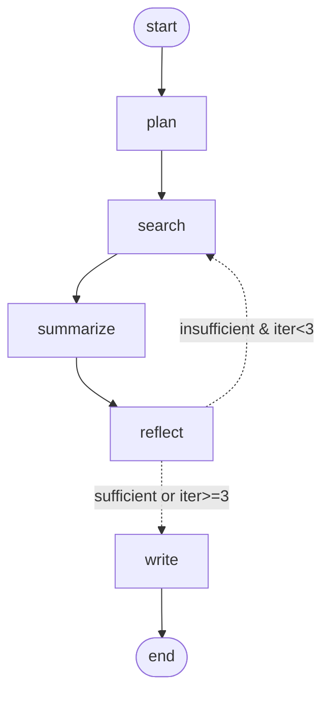

# 🔬 Research Agent

LangChain + LangGraph 오케스트레이션을 단계적으로 학습하기 위해 만든 자율 리서치 에이전트입니다.
주제를 입력하면 **웹 검색 → 요약 → 자가 반성(reflection) → 보고서 작성** 을 자동으로 수행합니다.

> 📖 **비개발자도 읽을 수 있는 종합 가이드**: [GUIDE.md](./GUIDE.md) — 서비스 소개·사용 매뉴얼·기술 설명·FAQ
>
> 설계 원칙: [CLAUDE.md](./CLAUDE.md) · 로드맵: [plan.md](./plan.md) · 학습 로그: [progress.md](./progress.md)

---

## 그래프 구조




직접 그려보려면 `uv run python scripts/show_graph.py` 실행.

## 스택

- Python 3.11+, `uv`
- `langgraph`, `langchain`, `langchain-anthropic`, `langchain-tavily`
- `langgraph-checkpoint-sqlite` (영속성)
- UI: `streamlit`
- 테스트: `pytest` + `FakeListChatModel`

## 빠른 시작

```bash
uv sync
cp .env.example .env       # TAVILY_API_KEY 등 입력
uv run pytest -q           # 19 tests
uv run python -m src.graph --fake "LangGraph reflection patterns"
uv run streamlit run ui/app.py
```

브라우저 → [http://localhost:8501](http://localhost:8501)

## 실행 모드


| 모드                   | 명령                                                  | 필요 키                  |
| -------------------- | --------------------------------------------------- | --------------------- |
| 단위 테스트               | `uv run pytest -q`                                  | 없음                    |
| Tavily 통합 테스트        | `uv run pytest tests/test_tavily_integration.py -v` | TAVILY                |
| CLI (가짜 LLM + 진짜 검색) | `uv run python -m src.graph --fake "<topic>"`       | TAVILY                |
| CLI (실제 LLM)         | `uv run python -m src.graph "<topic>"`              | ANTHROPIC + TAVILY    |
| 웹 UI                 | `uv run streamlit run ui/app.py`                    | TAVILY (Anthropic 선택) |


## Streamlit UI 시나리오

1. **기본 실행** — 토픽 입력 → 🚀 Run → 노드 타임라인이 한 카드씩 등장하며 최종 보고서 + 출처 출력
2. **영속성** — `thread_id` 를 메모해두고 새 탭/새로고침 후 *Resume Existing Thread* 로 같은 결과 복원
3. **HITL Interrupt** — 사이드바 "Interrupt before write" 토글 ON → write 직전 멈춤 → ➡️ Resume 클릭하면 보고서만 생성

## 디렉토리 구조

```
.
├── src/
│   ├── state.py             # ResearchState (TypedDict + reducers)
│   ├── llm.py               # ChatAnthropic factory
│   ├── graph.py             # StateGraph 조립 + CLI
│   ├── tools/web_search.py  # Tavily wrapper
│   └── nodes/
│       ├── plan.py          # 주제 → sub-questions
│       ├── search.py        # Tavily 검색 + iteration++
│       ├── summarize.py     # 새 항목만 요약 (pending slice)
│       ├── reflect.py       # 충분/부족 판단 + gap 질문
│       └── write.py         # 마크다운 보고서 작성
├── ui/app.py                # Streamlit UI (영속성+스트리밍+HITL)
├── tests/
│   ├── conftest.py          # FakeListChatModel 헬퍼
│   ├── test_state.py
│   ├── test_nodes.py
│   ├── test_reflect.py
│   ├── test_loop.py
│   ├── test_persistence.py
│   ├── test_graph.py
│   └── test_tavily_integration.py
├── scripts/show_graph.py    # 그래프 시각화 출력
└── checkpoints.sqlite       # SqliteSaver (gitignored)
```

## LangSmith로 trace 보기 (선택)

`.env` 에:

```
LANGSMITH_API_KEY=ls__...
LANGSMITH_TRACING=true
LANGSMITH_PROJECT=research-agent
```

이후 모든 그래프 실행이 LangSmith 대시보드에 기록됩니다 — 노드별 입출력, 토큰, 지연 시간, 루프 횟수까지 시각화.

## 학습 단계 요약


| 단계  | 핵심 개념                                                                                  |
| --- | -------------------------------------------------------------------------------------- |
| M1  | `StateGraph`, `TypedDict`, 노드 = 변화분 dict 반환, `compile()`                               |
| M2  | 외부 도구 래퍼, LLM DI, `Annotated[list, operator.add]` reducer, `FakeListChatModel`         |
| M3  | `add_conditional_edges`, 루프 cap, reducer 누적 처리 (`pending` slice)                       |
| M4  | `checkpointer` + `thread_id`, `interrupt_before` HITL, `graph.stream(stream_mode=...)` |
| M5  | UI 통합, 그래프 시각화, LangSmith, README                                                      |


각 단계의 *무엇을/왜/어떻게* 는 [progress.md](./progress.md) 참고.

## 확장 아이디어

- **Multi-agent** — Supervisor + (Researcher, Critic, Writer) 패턴으로 분리
- **RAG hybrid** — 사내 문서 retriever 추가 후 Tavily와 병렬 검색
- **평가** — LangSmith Datasets + LLM-as-judge 로 보고서 품질 자동 평가
- **배포** — LangGraph Cloud 또는 FastAPI + Docker

## 트러블슈팅

- `ANTHROPIC_API_KEY not set` → `--fake` 플래그 사용 또는 `.env` 에 키 입력
- Streamlit이 변경 반영 안 됨 → 브라우저에서 R 또는 Rerun 클릭 (Watchdog 미설치 시)
- Tavily 응답 비어있음 → 쿼리가 너무 길거나 모호한 경우. 일반적인 용어로 재시도

